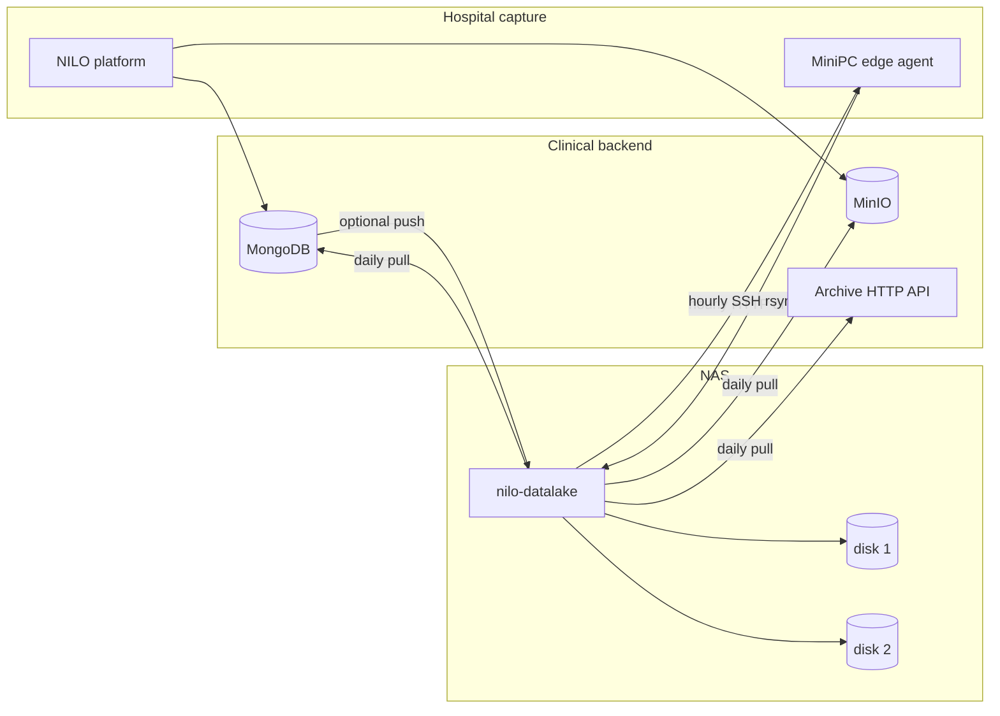

# NILO datalake

NILO records video, audio, physiological signals, posture, and face sessions. The clinical backend keeps that data in MongoDB and MinIO so the hospital application can use it immediately. This service is the archive that copies it onto a NAS.

It runs on the machine that mounts the NAS disks. A second process, the edge agent, runs on the MiniPC next to the capture rig when that machine cannot reliably reach the backend. Both are the same Python package.

The archive is the long-term copy. It does not replace MongoDB or MinIO, and it does not interpret clinical contents. It stores bytes, checksums them, and remembers what it has already copied so a run can be repeated.

## How the data moves

Two topologies are configured independently. A site can use one of them, or both.



**Backend path.** The platform uploads to the backend as it does today. Once a day the datalake pulls new MongoDB documents, new MinIO objects, or a page from a dedicated backend API. If the hospital network allows the backend to open a connection to the NAS but not the reverse, the backend pushes batches to the ingest API instead, or copies a drop folder with `rsync` or `scp`.

**MiniPC path.** The platform writes a finished session to a local spool. Every hour, either the edge agent on the MiniPC pushes that session to the NAS, or the datalake on the NAS connects over SSH and downloads it. A session is not touched until the recorder has created an empty `COMPLETE` file. That file is written last, so a video that is still being recorded stays where it is.

## Disks

Each mounted disk is a volume. The first disk in the configuration receives new files of a known size. When the free space left on that disk, after the reserve, is smaller than the next file, the file goes to the next enabled disk. A future 8 TB disk is another volume entry. Objects already stored are not moved.

An SSH pull does not know the session size until the copy finishes, so that copy lands on the volume with the most free space and stays there.

```yaml
storage:
  volumes:
    - id: disk1
      root: /srv/nilo-datalake/disk1
      enabled: true
    - id: disk2
      root: /srv/nilo-datalake/disk2
      enabled: true
  reserve_bytes: 53687091200   # 50 GiB held back on every disk
```

The catalog database should stay on a disk that remains mounted. The example keeps it on disk 1.

## Layout on disk

```
{volume}/
  archive/{site_id}/sessions/{session_id}/{logical_path}
  archive/{site_id}/metadata/{collection}/{yyyy}/{mm}/{dd}/{batch}-{chunk}.ndjson
  archive/{site_id}/blobs/{yyyy}/{mm}/{dd}/{bucket}/{object_key}
  inbox/{batch_id}/manifest.json
  inbox/{batch_id}/payload/...
  inbox/{batch_id}/READY
  staging/{batch_id}/          # API uploads, removed after commit
  quarantine/{batch_id}/       # a drop that failed its checks
  receipts/{batch_id}.json
{catalog_dir}/catalog.sqlite
{catalog_dir}/catalog.jsonl    # append-only journal, used to rebuild the index
```

Paths use the site id and the session id. They do not use a patient name. The session id must match `[A-Za-z0-9][A-Za-z0-9_.-]{0,127}`.

The same bytes for the same session and logical path are stored once. A later upload of different bytes for that path is kept beside the original, with the first 12 hex characters of the new SHA-256 in the file name. Nothing is overwritten.

## Project layout

```
src/nilo_datalake/
  cli.py            commands
  api.py            ingest API
  client.py         client used by the edge agent and usable by a Python backend
  edge.py           MiniPC agent
  sync.py           one-shot pull plus the in-process schedule
  writer.py         checksum, publish, catalog
  volumes.py        disk selection
  inbox.py          rsync/scp drop folder
  catalog.py        SQLite index and JSONL journal
  sources/          MongoDB, MinIO, backend HTTP, SSH/rsync
config/settings.example.yaml
config/settings.docker.yaml
deploy/systemd/     unit files for the NAS and the MiniPC
deploy.sh           installs host packages and starts the Docker stack
docker-compose.yml  datalake, MongoDB, and MinIO
```

## Install

Python 3.11 or newer.

```bash
python3 -m venv .venv
.venv/bin/pip install -e .
.venv/bin/nilo-datalake --help
```

On the NAS:

```bash
sudo mkdir -p /etc/nilo-datalake /srv/nilo-datalake/disk1
sudo cp config/settings.example.yaml /etc/nilo-datalake/settings.yaml
sudo cp .env.example /etc/nilo-datalake/datalake.env
# edit both files, then:
.venv/bin/nilo-datalake --config /etc/nilo-datalake/settings.yaml check-config
.venv/bin/nilo-datalake --config /etc/nilo-datalake/settings.yaml sync
```

`check-config` prints the resolved settings with secrets removed.

## Docker

`deploy.sh` is the first-boot path. It installs the host packages that are missing (`curl`, `rsync`, `openssh-client`, Docker, and the Compose plugin), writes `.env` from `config/docker.env.example` when that file is absent, and starts the stack. A later run only installs what is still missing and checks that each service answers. A failed check is printed in red with the command output and the container logs under it.

MongoDB and MinIO run as containers. Debian does not ship current packages for either, so the script does not `apt install` them.

```bash
./deploy.sh
```

The stack is three long-running containers plus a one-shot that creates the `nilo-media` bucket:

| Service | Address |
| --- | --- |
| datalake | http://127.0.0.1:8088 (published on the host interfaces so the backend and the MiniPC can reach it) |
| MinIO API | http://127.0.0.1:9000 (localhost only) |
| MinIO console | http://127.0.0.1:9001 (localhost only) |
| MongoDB | 127.0.0.1:27017 (localhost only) |

The archive, the catalog, the traces, and the runtime settings live in the `datalake` volume, mounted at `/data` inside the container. The image starts from `config/settings.docker.yaml`. On the first start, values from `.env` are copied into `/data/config/settings.yaml`. After that file exists, the [console](#console) is the source of truth: editing `.env` does not change a running archive. Delete the `datalake` volume to seed again. Change the development key before pointing this at a hospital.

```bash
docker compose logs -f datalake
docker compose exec datalake nilo-datalake traces
docker compose exec datalake nilo-datalake status
```

`docker compose up -d` is enough on a machine where Docker is already installed. `deploy.sh` is the command that also prepares the host.

## Console

Open `http://127.0.0.1:8088/console` (the site root redirects there). The default login is the `NILO_CONSOLE_USERNAME` and `NILO_CONSOLE_PASSWORD` pair from `.env` (`admin` / `nilo-dev-key` until you change them). That password is only for the console. The ingest API key is separate.

The page edits the schedule, disk paths, MongoDB, MinIO, the backend API, SSH sources, the ingest key, the edge agent, and the console account. A secret field that is left blank keeps the value already stored. **Save** writes `/data/config/settings.yaml` and applies the schedule immediately. The console password is stored as a scrypt hash; the file does not keep the plaintext. Changing the ingest bind host or port is stored at once and takes effect after **Restart service** (the container exits and Docker starts it again). **Run sync now** starts one pull without waiting for the cron.

## Traces

Every sync, HTTP request (except `/v1/health`, `/`, `/console`, and `/console/static`), and edge shipment gets a trace id. The id is in each log line (`trace=...`) and, for uploads, in the `X-Trace-Id` response header. A step that fails appends one JSON object to `failures.jsonl` with the component, the operation, the file, the line, the exception, and the stack.

```text
{catalog_dir}/traces/datalake.jsonl    every log line
{catalog_dir}/traces/failures.jsonl    errors only
```

Inside Docker those files are `/data/traces/`. The same trace id appears on the successful steps of that run, so one failure can be followed through the rest of the attempt.

```bash
nilo-datalake --config /etc/nilo-datalake/settings.yaml traces
nilo-datalake --config /etc/nilo-datalake/settings.yaml sync
```

`sync` prints the trace id in its summary. `traces` prints the recent failures and their stacks.

Run `serve` **or** the systemd sync timer, not both. `serve` already runs the daily pull and the inbox scan. A second timer would start a second pull of the same data. SQLite will wait, but the journal must be written by one process at a time.

## Configuration

`nilo-datalake serve` reads `NILO_CONFIG` (or `--config`) and ignores the environment once that file exists, so a console edit survives a restart. The environment is applied only while the file is being created. In Docker that happens on the first start: `NILO_BOOTSTRAP_CONFIG` is the image file, and the process environment (from `.env`) is copied into `NILO_CONFIG`. Nested keys use two underscores: `NILO_PULL__MONGO__URI` overrides `pull.mongo.uri` during that copy. `load_settings` still applies the environment over a YAML file; the console path does not.

| Section | Role |
| --- | --- |
| `storage` | Volume roots, reserve, catalog path |
| `ingest` | HTTP API that receives pushes |
| `pull` | Daily copy from MongoDB, MinIO, the backend API, and SSH |
| `inbox` | Scan for finished `rsync`/`scp` drops |
| `edge` | Read by the MiniPC agent only |
| `console` | Username and password for the web console |

`pull.safety_delay_seconds` (default 120) leaves out MongoDB documents and MinIO objects that changed moments ago. The next run picks them up after the writer has finished.

## Ingest API

The backend, or the edge agent, pushes one batch:

1. `POST /v1/batches` with `{"site_id": "hospital-a", "source": "backend"}`.
2. `PUT /v1/batches/{batch_id}/objects?logical_path=video/cam.mp4` for each file.
3. `POST /v1/batches/{batch_id}/commit`.

Authentication is `Authorization: Bearer <ingest.api_key>`. `GET /v1/health` does not require it. `GET /v1/status` and batch routes do.

Upload headers:

| Header | Required | Meaning |
| --- | --- | --- |
| `X-Checksum-Sha256` | yes | Hex SHA-256 of the body |
| `X-Session-Id` | no | Session this file belongs to |
| `X-Kind` | no | `video`, `audio`, `face`, `physiological`, `postural`, `metadata`, or `other` |
| `X-Captured-At` | no | ISO-8601 capture time |
| `Content-Type` | no | Stored next to the object |

If `X-Kind` is omitted, a parent directory named `face`, `video`, `audio`, `physiological`, or `postural` wins over the file suffix. `face/camera.mp4` is stored as `face`.

Commit hashes the staged files again and publishes them. Repeating the commit returns the committed batch. Sending the same bytes in a later batch reports `duplicates` and does not write a second copy. A checksum mismatch is rejected and the batch stays open so the file can be sent again.

`GET /v1/status` returns free space per volume, the object count, and the latest batches.

A Python caller can use `nilo_datalake.client.DatalakeClient` instead of speaking HTTP itself.

## Drop folder for rsync and scp

Anything that can copy files onto the NAS can fill a directory under a volume's `inbox`. The datalake does not watch the copy until a `READY` marker exists. Write that marker last.

```
inbox/{batch_id}/manifest.json
inbox/{batch_id}/payload/video/cam.mp4
inbox/{batch_id}/READY
```

`manifest.json`:

```json
{
  "schema_version": 1,
  "batch_id": "the-directory-name",
  "site_id": "hospital-a",
  "source": "backend-rsync",
  "created_at": "2026-10-01T02:00:00+00:00",
  "objects": [
    {
      "logical_path": "video/cam.mp4",
      "payload_path": "payload/video/cam.mp4",
      "sha256": "64 lowercase hex characters",
      "size_bytes": 1234,
      "kind": "video",
      "session_id": "sess-1",
      "content_type": "video/mp4",
      "captured_at": "2026-10-01T01:10:00+00:00"
    }
  ]
}
```

`batch_id` in the manifest must equal the directory name. Every checksum and size is checked before any file is published. A failure moves the directory to `quarantine/{batch_id}/` and writes `ERROR.txt`. While `serve` is running, `inbox.poll_seconds` controls how often this scan runs. `nilo-datalake promote` runs it once.

Point `rsync` at the inbox of the disk that should receive the data. When disk 1 is close to the reserve, point it at disk 2. The HTTP API chooses the disk itself.

## Pull from MongoDB

Enable `pull.mongo` and list the collections. Each collection needs a timestamp field (default `updated_at`) and an `_id`. The cursor is that timestamp plus `_id`, so two documents that share a timestamp are not skipped after a crash. Set `timestamp_is_string: true` when the field is stored as text rather than a BSON date.

Documents are written as NDJSON under `archive/{site}/metadata/{collection}/{yyyy}/{mm}/{dd}/`. One file holds up to `chunk_size` documents. The watermark advances only after that file is in the archive. A crash repeats at most the unfinished chunk. The backend should index `(updated_at, _id)`.

ObjectId and datetime values are encoded with MongoDB extended JSON, so the original types can be read back.

## Pull from MinIO

Enable `pull.minio` and list the buckets. An object whose ETag is already in the catalog is not downloaded again. Objects newer than the safety delay wait for the next run.

Keys under `{session_prefix}{session_id}/` (default `sessions/{session_id}/`) are stored inside that session. The prefix is removed from the logical path, so `sessions/sess-1/video/cam.mp4` becomes `video/cam.mp4` on session `sess-1`. Any other key is stored under `blobs/{yyyy}/{mm}/{dd}/{bucket}/{key}`.

## Pull from the backend HTTP API

Enable `pull.http` when the backend exposes an archive feed. The datalake does not invent queries against private collections in that mode. The backend decides what is new.

`GET {base_url}/changes?since={watermark}&limit={page_limit}`

```json
{
  "watermark": "opaque-token",
  "items": [
    {
      "type": "metadata",
      "collection": "sessions",
      "document": {"_id": "sess-1", "updated_at": "2026-10-01T01:00:00+00:00"}
    },
    {
      "type": "object",
      "session_id": "sess-1",
      "logical_path": "video/cam.mp4",
      "kind": "video",
      "sha256": "64 lowercase hex characters",
      "size_bytes": 1234,
      "content_type": "video/mp4",
      "captured_at": "2026-10-01T01:10:00+00:00",
      "download_url": "objects/cam"
    }
  ]
}
```

Send `Authorization: Bearer <pull.http.api_key>`. A relative `download_url` is resolved against `base_url` and is fetched with that key. An absolute `download_url` is fetched without the key, so it can be a presigned MinIO link. An empty `items` array ends the run. The watermark from the page is saved only after that page has been stored. If the watermark does not move, the run stops.

## Pull over SSH

Enable `pull.ssh` when the NAS is allowed to connect to the MiniPC or to an export directory on the backend, and those machines cannot open a connection back. The transport is rsync over SSH, so an interrupted multi-gigabyte video resumes.

The remote directory is a spool of sessions:

```
/var/nilo/spool/ready/{session_id}/video/cam.mp4
/var/nilo/spool/ready/{session_id}/COMPLETE
```

`remote` is either `user@host:/absolute/path` or a local directory. `ssh_command` is passed to rsync with `-e`. A session without `COMPLETE` is left in place. After a successful archive the session is recorded and is not downloaded again.

`delete_after: false` is the default. Turn it on only after a copy has been checked. With it on, the remote session directory is removed after the archive accepts the files. If that delete fails, the next run tries the delete again and does not download the bytes a second time.

## MiniPC edge agent

The capture app writes here and creates `COMPLETE` last:

```
/var/nilo/spool/ready/{session_id}/video/cam.mp4
/var/nilo/spool/ready/{session_id}/audio/mic.wav
/var/nilo/spool/ready/{session_id}/physiological/ecg.csv
/var/nilo/spool/ready/{session_id}/COMPLETE
```

Symlinks and dotfiles are ignored. `COMPLETE` itself is not uploaded.

`edge.transport: http` uses the ingest API. `edge.transport: rsync` builds a drop folder and copies `READY` in a second rsync, after the payload. A successful ship moves the session to `{spool}/sent/{session_id}`. A failure leaves it in `ready` for the next hour. The NAS deduplicates a retry.

```bash
nilo-datalake --config /etc/nilo-datalake/edge.yaml edge once
nilo-datalake --config /etc/nilo-datalake/edge.yaml edge run
```

`edge once` is what the hourly systemd timer runs. `edge run` loops in the foreground.

## Commands

```bash
nilo-datalake --config /etc/nilo-datalake/settings.yaml serve
nilo-datalake --config /etc/nilo-datalake/settings.yaml sync
nilo-datalake --config /etc/nilo-datalake/settings.yaml promote
nilo-datalake --config /etc/nilo-datalake/settings.yaml status
nilo-datalake --config /etc/nilo-datalake/settings.yaml gc
nilo-datalake --config /etc/nilo-datalake/settings.yaml rebuild-catalog
nilo-datalake --config /etc/nilo-datalake/settings.yaml check-config
nilo-datalake --config /etc/nilo-datalake/settings.yaml traces
nilo-datalake --config /etc/nilo-datalake/edge.yaml edge once
```

`sync` exits with status 1 when a source reported an error. `gc` deletes API batches that are still open after `inbox.abandon_after_hours`, and inbox directories that never received `READY`. It does not delete quarantined drops or archived files.

## systemd

The unit files in `deploy/systemd/` assume the virtualenv is `/opt/nilo-datalake/.venv` and the Unix user is `nilo`.

On the NAS, install `nilo-datalake.service` when the API and the in-process schedule should stay up. Install `nilo-datalake-sync.service` and `nilo-datalake-sync.timer` instead when you want a daily oneshot and no long-running process. Do not enable the timer while `pull.enabled` is true inside `serve`.

On the MiniPC, install `nilo-edge.service` and `nilo-edge.timer`.

## Integrity

Every published file is hashed with SHA-256 before it is visible in the archive. The hash is stored in SQLite and appended to `catalog.jsonl`. The journal line is written before the SQLite row. If the database file is lost:

```bash
nilo-datalake --config /etc/nilo-datalake/settings.yaml rebuild-catalog
```

That replays the journal. The bytes on the volumes are the archive. The database is an index.

A sync that is already running ignores a second trigger. Pulling a large day must not overlap the next one.

## Security

Put the API key in the environment or in a file readable only by the `nilo` user. Bind the service to the hospital LAN and terminate TLS in a reverse proxy if the traffic leaves that LAN. `allow_insecure_no_auth` is for a private development machine. OpenAPI and the interactive docs are not served.

An upload must send `Content-Length`. The body is rejected when it grows past that length or past `ingest.max_object_bytes` (default 32 GiB). Eight failed console logins from the same address lock that username for a minute. The console cookie is signed with a random session secret, and the password is stored as a scrypt hash.

Pulling the backend API does not follow redirects, so the bearer token stays on `pull.http.base_url`. An absolute `download_url` is fetched without that token, and only when it is `http` or `https` with no userinfo. SSH remotes reject a host that looks like a shell or an option, and `delete_after` refuses to remove a path with fewer than three directories.

MongoDB and MinIO publish their host ports on `127.0.0.1` only. The archive API stays reachable from the LAN because the backend and the MiniPC push to it.

Logs contain session ids, logical paths, and byte counts. They do not contain file bodies or document contents. Disk encryption, the NAS access control list, and who may SSH to the spool are operational controls this process does not provide.

`delete_after` and a drop folder are the two places where a remote copy is removed or a directory is accepted from outside. Keep `delete_after` off until the first archives have been checked.

## Assumptions

The backend schema is not part of this repository. Collection names, timestamp fields, bucket names, and the `sessions/{session_id}/` key prefix are configuration. MongoDB documents are archived whole, as extended JSON, so the session id stays inside the document.

The backend archive API described above is the contract to implement if that pull mode is used. MongoDB and MinIO can be pulled directly when the NAS can open those ports, with no extra backend endpoint.

One datalake process should own the catalog. The edge agent does not open it. Patient identifiers other than the session id are not placed in directory names.

## Tests

```bash
.venv/bin/pip install -e ".[dev]"
.venv/bin/pytest
```

The tests use temporary directories. They do not need a running MongoDB or MinIO.
